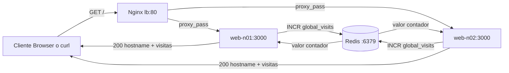
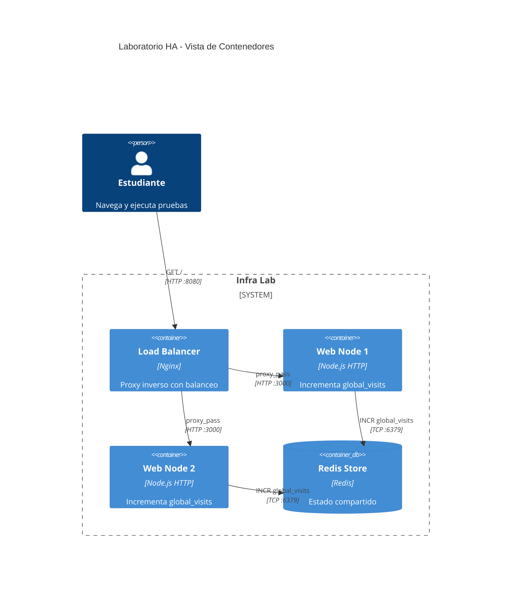

# Arquitecturas Web HA
## Balanceo de Carga + Estado Compartido

Materia: Informatica y Programacion

---

# Objetivos de aprendizaje

- Entender disponibilidad y tolerancia a fallos en arquitectura web.
- Diferenciar escalado horizontal de vertical.
- Ver por que el estado compartido evita inconsistencias.
- Relacionar teoria con evidencia real en contenedores.

---

# Que servicios corren en este laboratorio

- lb: Nginx como balanceador L7 y proxy inverso.
- web-n01: App Node.js con modulo http nativo.
- web-n02: Segundo nodo identico al primero.
- redis-store: Almacen de estado compartido (contador global).

Puertos:

- localhost:8080 -> lb:80
- redis local opcional: localhost:6379 -> redis-store:6379

---

# Evidencia de ejecucion actual

Estado observado con docker compose ps:

- infra-lab-lb-1: Up, publica 8080.
- infra-lab-web-n01-1: Up, puerto interno 3000.
- infra-lab-web-n02-1: Up, puerto interno 3000.
- infra-lab-redis-store-1: Up, publica 6379.

Interpretacion:

- Hay redundancia activa en capa web.
- Hay un punto central de estado para mantener consistencia.

---

# Como viaja una peticion

1. Cliente envia GET a localhost:8080.
2. Nginx decide backend segun su algoritmo de balanceo.
3. Nodo web ejecuta INCR global_visits en Redis.
4. Redis devuelve el nuevo valor atomico.
5. Nodo responde hostname + contador global.

Resultado visible:

- Cambia hostname entre nodos.
- El contador siempre sigue una sola secuencia global.

---

# Diagrama de flujo de request

---

# C4 - Vista de Contenedores

---

# Que pasa si se cae un nodo

Experimento:

- Se detiene web-n01.
- Se vuelve a consultar localhost:8080.

Comportamiento esperado:

- El sistema sigue respondiendo desde web-n02.
- La app sigue contando visitas porque Redis sigue activo.
- Se demuestra alta disponibilidad parcial (sin auto healing).

---

# Conceptos clave para explicar en clase

- HA no es cero caidas: es continuidad de servicio ante fallas.
- Balanceo distribuye carga y mejora resiliencia.
- Estado compartido evita contadores divergentes entre nodos.
- Cuello de botella actual: un solo Redis y un solo Nginx.

---

# Limitaciones actuales del laboratorio

- Nginx es single point of failure.
- Redis no tiene replica ni Sentinel.
- No hay health checks de aplicacion en Compose.
- No hay autoscaling ni observabilidad profunda.

Esto es ideal para introducir mejoras incrementales.

---

# Propuesta avanzada para estudiantes

Consigna: Evolucionar la arquitectura a una version mas robusta.

Entregables minimos:

- Agregar health endpoint en Node (/healthz).
- Configurar healthcheck para web-n01 y web-n02.
- Implementar rate limiting basico en Nginx.
- Medir latencia p50 y p95 antes y despues.
- Documentar resultados con tablas y conclusiones.

---

# Extension opcional nivel alto

- Redis con persistencia AOF y analisis de reinicio.
- Replica de Redis + estrategia de failover teórica.
- Segundo balanceador con DNS round robin (simulado).
- Pruebas de caos: detener servicios en secuencia y observar.

---

# Rubrica sugerida

- 30% Correctitud tecnica y funcionamiento reproducible.
- 25% Calidad de arquitectura y decisiones justificadas.
- 20% Pruebas y metricas comparativas.
- 15% Documentacion y claridad de diagramas.
- 10% Presentacion oral y defensa tecnica.

---

# Guion breve para exponer

- Slide 1 a 3: contexto y objetivo.
- Slide 4 a 7: funcionamiento interno con evidencia y diagramas.
- Slide 8 a 10: fallas, limites y mejoras.
- Slide 11 a 13: consigna, rubrica y cierre.

---

# Cierre

Idea central:

La combinacion balanceador + multiples nodos + estado compartido
permite demostrar en forma simple y medible los principios de
alta disponibilidad en aplicaciones web.
